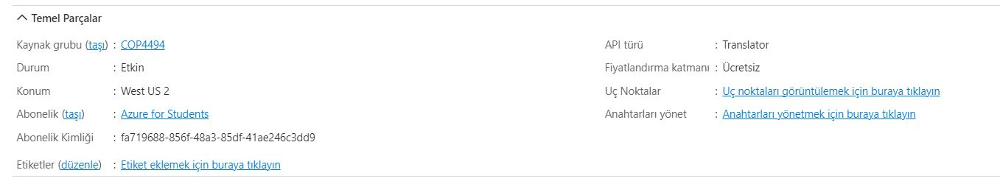
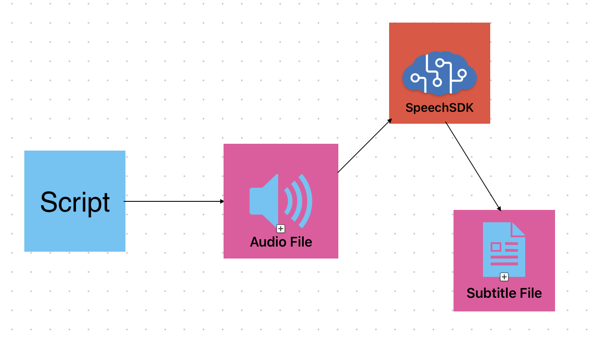

# Azure Fundamentals II

Furkan Doğancan Baytemur - 1804527

## Introduction

This project aims to create subtitles for any video. It uses SpeechSDK of Azure to get transcription of audio files that are converted from video files. Then, we create SRT files to generate our subtitles.

# Resource

# Diagram

# Overview

- Created SpeechSDK with *Cognitive Services of Azure.*
- Created a Python script to connect to SpeechSDK with API Key.
- Python script takes a WAV files as input.
- Then, it sends the WAV file to SDK to get transcription of the audio.
- At the same time, script also gets the starting time and duration of texts.
- After transcription is completed, script saves text and times with appropriate format of a SRT file.
- With that, our subtitle file is ready and can be used to display subtitle in a video player.

## Github Repo
https://github.com/Kaaleyah/subtitleGenerator/edit/main/README.md
